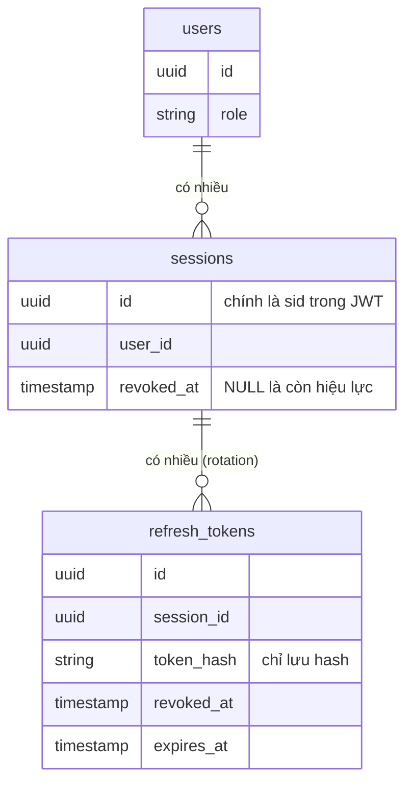
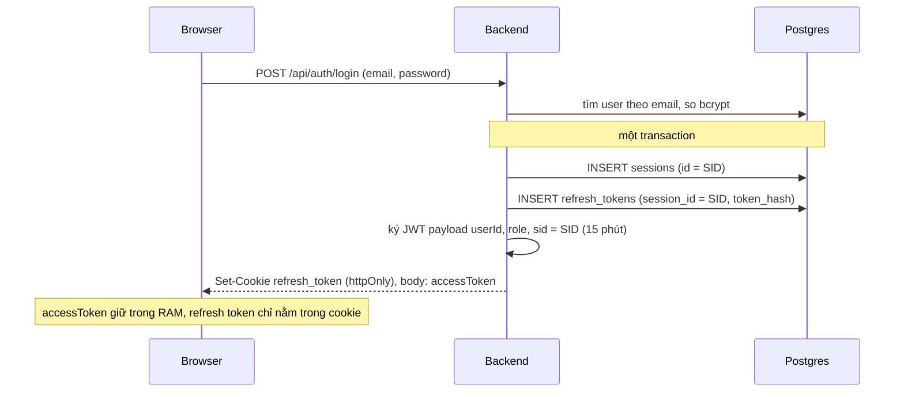
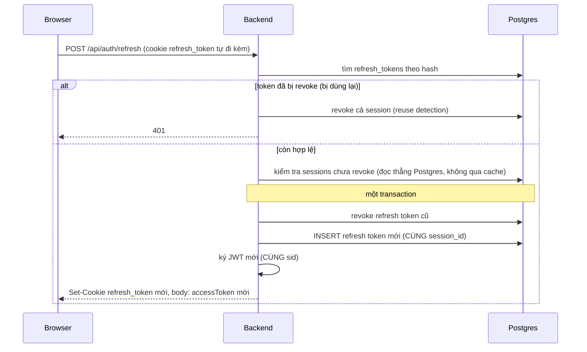
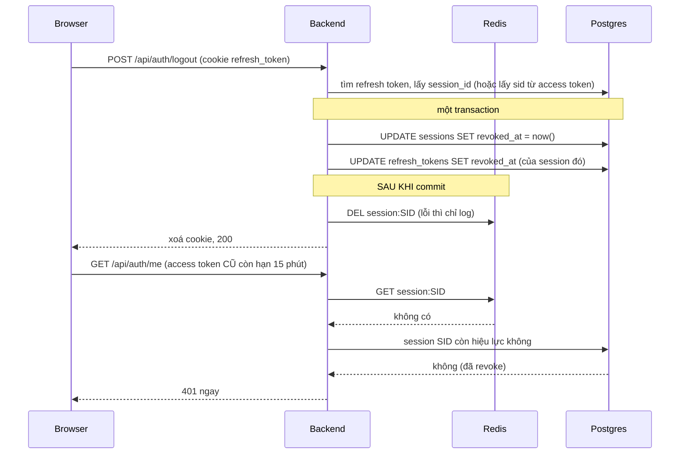

```mermaid
erDiagram
    users ||--o{ sessions : "có nhiều"
    sessions ||--o{ refresh_tokens : "có nhiều (rotation)"
    users {
        uuid id
        string role
    }
    sessions {
        uuid id "chính là sid trong JWT"
        uuid user_id
        timestamp revoked_at "NULL là còn hiệu lực"
    }
    refresh_tokens {
        uuid id
        uuid session_id
        string token_hash "chỉ lưu hash"
        timestamp revoked_at
        timestamp expires_at
    }
```

```mermaid
sequenceDiagram
    participant B as Browser
    participant S as Backend
    participant P as Postgres
    B->>S: POST /api/auth/login (email, password)
    S->>P: tìm user theo email, so bcrypt
    Note over S,P: một transaction
    S->>P: INSERT sessions (id = SID)
    S->>P: INSERT refresh_tokens (session_id = SID, token_hash)
    S->>S: ký JWT payload userId, role, sid = SID (15 phút)
    S-->>B: Set-Cookie refresh_token (httpOnly), body: accessToken
    Note over B: accessToken giữ trong RAM, refresh token chỉ nằm trong cookie
```

```mermaid
sequenceDiagram
    participant B as Browser
    participant S as Backend
    participant P as Postgres
    B->>S: POST /api/auth/refresh (cookie refresh_token tự đi kèm)
    S->>P: tìm refresh_tokens theo hash
    alt token đã bị revoke (bị dùng lại)
        S->>P: revoke cả session (reuse detection)
        S-->>B: 401
    else còn hợp lệ
        S->>P: kiểm tra sessions chưa revoke (đọc thẳng Postgres, không qua cache)
        Note over S,P: một transaction
        S->>P: revoke refresh token cũ
        S->>P: INSERT refresh token mới (CÙNG session_id)
        S->>S: ký JWT mới (CÙNG sid)
        S-->>B: Set-Cookie refresh_token mới, body: accessToken mới
    end
```

```mermaid
sequenceDiagram
    participant B as Browser
    participant S as Backend
    participant R as Redis
    participant P as Postgres
    B->>S: POST /api/auth/logout (cookie refresh_token)
    S->>P: tìm refresh token, lấy session_id (hoặc lấy sid từ access token)
    Note over S,P: một transaction
    S->>P: UPDATE sessions SET revoked_at = now()
    S->>P: UPDATE refresh_tokens SET revoked_at (của session đó)
    Note over S,R: SAU KHI commit
    S->>R: DEL session:SID (lỗi thì chỉ log)
    S-->>B: xoá cookie, 200
    B->>S: GET /api/auth/me (access token CŨ còn hạn 15 phút)
    S->>R: GET session:SID
    R-->>S: không có
    S->>P: session SID còn hiệu lực không
    P-->>S: không (đã revoke)
    S-->>B: 401 ngay
```
