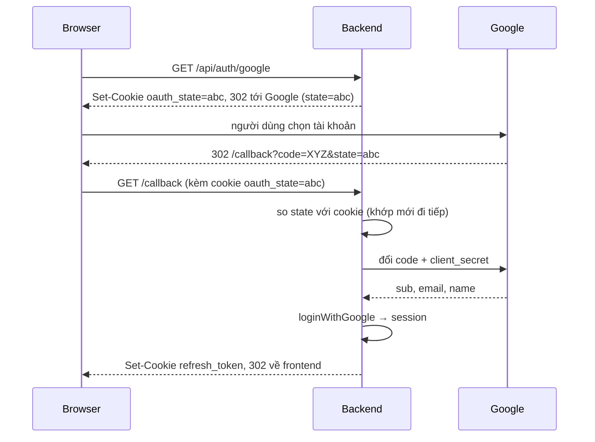

```mermaid
sequenceDiagram
    participant B as Browser
    participant S as Backend
    participant G as Google
    B->>S: GET /api/auth/google
    S-->>B: Set-Cookie oauth_state=abc, 302 tới Google (state=abc)
    B->>G: người dùng chọn tài khoản
    G-->>B: 302 /callback?code=XYZ&state=abc
    B->>S: GET /callback (kèm cookie oauth_state=abc)
    S->>S: so state với cookie (khớp mới đi tiếp)
    S->>G: đổi code + client_secret
    G-->>S: sub, email, name
    S->>S: loginWithGoogle → session
    S-->>B: Set-Cookie refresh_token, 302 về frontend
```
